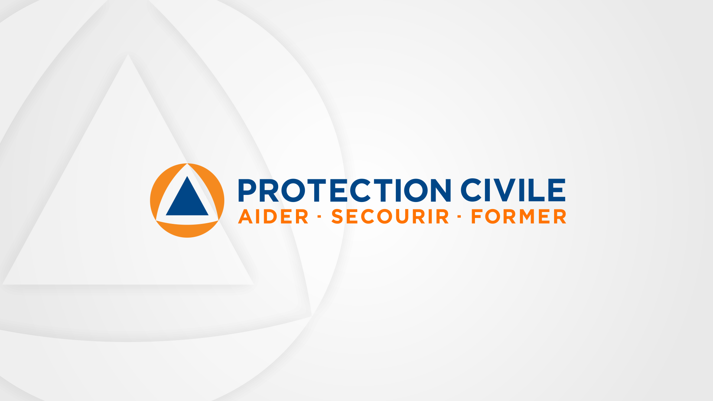
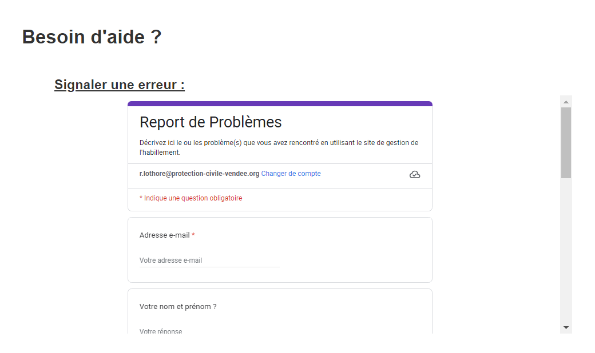
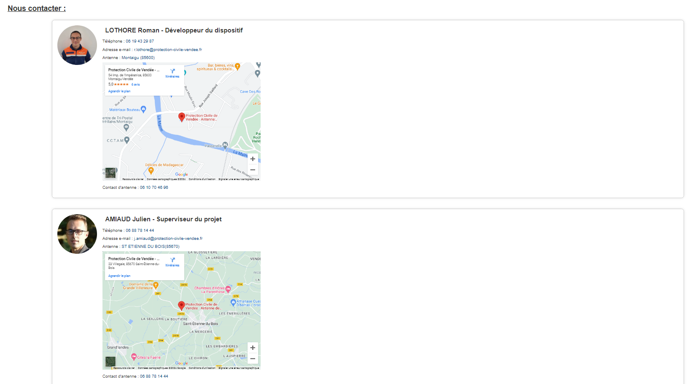

# PROJET HABILLEMENT - SECTEUR VENDEE

## Introduction :
Il est aujourd'hui plus compliqué pour une antenne de réussir à bien gérer le stock de vêtements qu'elle possède, d'en gérer les tailles, l'état, et autres, le tout sans une quantité énorme de papier. L'objectif de ce projet est de pouvoir faciliter, pour chaque antenne qui le souhaite, cette gestion, a l'aide d'un simple référencement des vêtements. L'objectif est plutôt simple : Intégrer des puces aux vêtements afin de les scanner lors d'un emprunt, d'un lavage, etc...

## Contenu du projet :
### - Partie Utilisateur :
* Site internet protégé par 2 identifiants par antenne (Identifiant d'antenne + identifiant du responsable de la commission habillement)

* Simple scan avec un lecteur lors d'un emprunt / d'un lavage
[INTEGRER SCREENSHOT]
* Contact simple avec un formulaire ou un contact direct avec les responsables du projet

## Langages utilisés :

 - HTML
 - CSS
 - PHP
 - JavaScript
 - Python
 - Bash